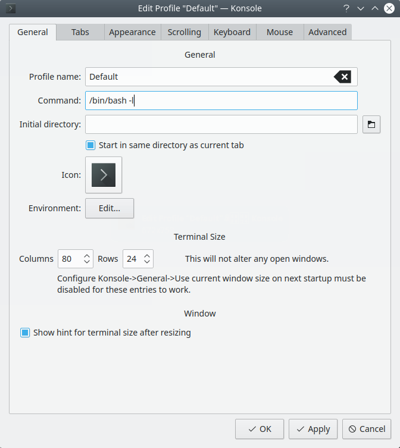

# HashView
Painstakingly configured and installed with :heart: by Justin for Kubuntu 18.04.


## Installation Notes

### Workspace Setup
Create an appropriate workspace to utilize the files of this project prior to cloning:
```sh
$ sudo apt-get update
$ sudo apt-get install git mysql-server libmysqlclient-dev redis-server openssl software-properties-common -y
$ sudo systemctl disable redis-server
$ sudo service redis-server stop
$ cd ~/Documents
$ git clone https://github.com/EspressoCake/HashView.git
```


### Preparation of Video Card Drivers
Due to conflicts with potentially pre-existing drivers, it is necessary to implement a kernel block.
```sh
$ sudo bash -c "echo blacklist nouveau > /etc/modprobe.d/blacklist-nvidia-nouveau.conf"
$ sudo bash -c "echo options nouveau modeset=0 >> /etc/modprobe.d/blacklist-nvidia-nouveau.conf"
$ sudo update-initramfs -u
$ sudo reboot
```

Upon rebooting, architecture support for 32-bit compilation settings must be obtained:
```sh
$ sudo dpkg --add-architecture i386
$ sudo apt-get update
$ sudo apt-get install build-essential libc6:i386
```

Obtain the most current driver for the video card(s), as of this time, they can be found [here](http://www.nvidia.com/Download/index.aspx)

```sh
$ cd ~/Documents/HashView
$ wget http://us.download.nvidia.com/XFree86/Linux-x86_64/410.78/NVIDIA-Linux-x86_64-410.78.run
$ sudo chmod +x NVIDIA-Linux-x86_64-410.78.run
$ sudo ./NVIDIA-Linux-x86_64-410.78.run
```

Accept default values as necessary, followed by a reboot of the system:
```sh
$ sudo reboot
```


### MySQL Configuration and Optimization
With MySQL installed, it will be necessary to alter the root account password in order to work properly:
```sh
$ sudo service start mysqld
$ sudo mysql
mysql> FLUSH PRIVILEGES;
mysql> ALTER USER 'root'@'localhost' IDENTIFIED BY 'SOME_NEW_PASSWORD';
mysql> exit
$ sudo vi etc/mysql/mysql.conf.d/mysqld.cnf
```

Add the following under the [mysqld] directive:
```sh
innodb_flush_log_at_trx_commit  = 0
innodb_file_format = Barracuda
innodb_large_prefix = 1
innodb_file_per_table=true
```

Upon exiting:
```sh
$ sudo service mysql restart
```

### Configuring the Ruby environment
Update your current repository to pull in the development packages:
```sh
$ sudo apt-add-repository -y ppa:rael-gc/rvm
$ sudo apt-get update
$ sudo apt-get install rvm -y
```

Configure the current user that you are logged in as to have a login shell only:


Install Ruby
```sh
$ sudo apt-get update && apt-get install openssl1.0 -y
$ sudo rvm install ruby-2.2.4 --with-openssl-dir=/usr/lib/ssl1.0/
$ sudo rvm use 2.4.4
$ sudo gem install bundler
$ sudo bundle install
```


### Enable database connectivity for the application:
```sh
$ cd ~/Documents/HashView/hashview/
$ cp config/database.yml.example config/database.yml
$ vim config/database.yml
```
Alter the password to reflect that of the one previously modified for MySQL.


### Create an initial database
```sh
$ RACK_ENV=production bundle exec rake db:setup
```


### Configure the pathing to the cloned hashcat binary and reflect the following:
```sh
$ vim ~/Documents/HashView/hashview/config/agent.json

{
  "ip": "127.0.0.1",
  "port": "4567",
  "uuid": "0e566bcb-bb12-448f-a073-76e5b46c9cec",
  "hc_binary_path": "/home/YOURUSER/Documents/HashView/hashview/hashcat-5.1.0/hashcat64.bin"
}
```


### Launching HashView
Ideally, kick this off in a terminal multiplexer (screen, tmux, etc.):
```sh
$ screen -S HashView
```

In the secondary window, start ruby with the proper environment variables:
```
$ RACK_ENV=production TZ='America/New_York' foreman start
```

Assuming the process is running as intended, detach the session, and access via: https://127.0.0.1:4567
